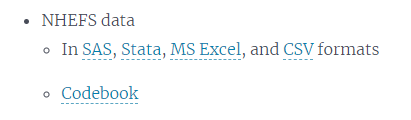

# 今日のゴール
* サンプルデータを作る

# 今日の目的

# サンプルデータ
[Causal Inference: What If](https://www.hsph.harvard.edu/miguel-hernan/causal-inference-book/)サイトにあるNHEFSデータを用います。

ここから、Stataのデータをダウンロードすると、zipファイルが保存されます。解凍した上で、今回のコース用の作業用フォルダ[^1]（以下、作業フォルダ）に保存して下さい。

## データの中身を確認
このデータはNational Health and Nutrition Examination Survey Data I Epidemiologic Follow-up Study (NHEFS)というコホート研究のデータです。詳細な変数の意味などは、Codebookに記載されています。

# 研究仮説
このデータを用いて、まず、下記のようなPECOについて検討することにします。

* P: 1970年代～1980年代に生きていた成人アメリカ人。
* E: ベースライン(1971年）からフォローアップ(1982年)までの間に禁煙した。
* C: 上記期間に禁煙していない。
* O: 上記期間の体重変化

古典的には、臨床上・公衆衛生上の疑問を研究に向いた形に定式化するにはPICO／PECOで行なわれています。しかし、より丁寧な検討を行なうためには、これだけでは不十分です。これらに加えて**Estimand**[^2]という概念を検討する必要があります。

## Estimand
これは、「どのような効果が知りたいのか？」を意味しています。[Difference-in-Differencesに関して解説されているサイト](https://diff.healthpolicydatascience.org/)では、下記の図を用いて、Estimand・Estimator・Estimatesの違いが説明されています。

言葉で示すとEstimandは、

* 誰が
* どういう介入・曝露を受けた時に
* アウトカムがどのくらい変化するか？
* 
という「知りたい効果」になります。

臨床研究を考える上で、Estimandを考える上では、ざっくりと下記の2点について考える必要があります。

1. 誰を対象とした効果なのか？
2. 中間事象（脱落、不適合など）はどう扱うのか？

ここでは、前者について考えます。誰を対象としているのかによって、効果には名前がついています。

|   | ATE | ATT | ATU | Conditional ATE | Local ATE | ATO |
|:-:| :-: | :-: | :-: | :-:             | :-:       | :-: |
|**標的集団**| 集団全体 | 介入者・曝露者 | 非介入者・非曝露者 | 集団全体  | Complier       | 背景情報がよくにた集団 |
|**解析集団**| IPTW    | 傾向スコアマッチング | 傾向スコアマッチング | 交互作用項を含む多変量回帰モデル | 操作変数法 | オーバーラップ重み付け |

[^1]: このタイミングで適当なところに作成して下さい。
[^2]: 日本語訳はまだありませんが、Modern Epidemiology 4th Edの訳本では「推定目標」と訳されています。
