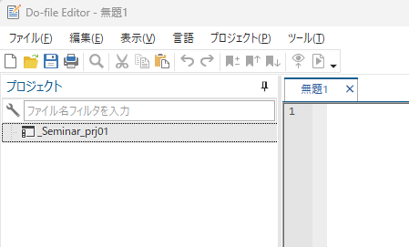

# 今日のゴール
* サンプルデータの解析（重回帰分析）を行なう

# 今日の目的
* Projectファイルを作ってからの流れを実行する。
* 複数のdo-fileで解析を実行する。

# サンプルデータ
[Causal Inference: What If](https://www.hsph.harvard.edu/miguel-hernan/causal-inference-book/)サイトにあるNHEFSデータを用います。


ここから、Stataのデータをダウンロードすると、zipファイルが保存されます。解凍した上で、今回のコース用の作業用フォルダ[^1]（以下、作業フォルダ）に保存して下さい。

## データの中身を確認
このデータはNational Health and Nutrition Examination Survey Data I Epidemiologic Follow-up Study (NHEFS)というコホート研究のデータです。詳細な変数の意味などは、Codebookに記載されています。

# 解析方針
## 研究仮説（1）
このデータを用いて、まず、下記のようなPECOについて検討することにします。

* P: 1970年代～1980年代に生きていた成人アメリカ人。
* E: ベースライン(1971年）からフォローアップ(1982年)までの間に禁煙した。
* C: 上記期間に禁煙していない。
* O: 上記期間の体重変化

古典的には、臨床上・公衆衛生上の疑問を研究に向いた形に定式化するにはPICO／PECOで行なわれています。しかし、より丁寧な検討を行なうためには、これだけでは不十分です。これらに加えて**Estimand**[^2]という概念を検討する必要があります。

## Estimand
これは、「どのような効果が知りたいのか？」を意味しています。[Difference-in-Differencesに関して解説されているサイト](https://diff.healthpolicydatascience.org/)では、下記の図を用いて、Estimand・Estimator・Estimatesの違いが説明されています。


言葉で示すとEstimandは、

* 誰が
* どういう介入・曝露を受けた時に
* アウトカムがどのくらい変化するか？

という「知りたい効果」になります。

臨床研究を考える上で、Estimandを考える上では、ざっくりと下記の2点について考える必要があります。

1. 誰を対象とした効果なのか？
2. 中間事象（脱落、不適合など）はどう扱うのか？

ここでは、前者について考えます。誰を対象としているのかによって、効果には名前がついています。

|   | ATE | ATT | ATU | Conditional ATE | Local ATE | ATO |
|:-:| :-: | :-: | :-: | :-:             | :-:       | :-: |
| **標的集団** | 集団全体 | 介入者・曝露者 | 非介入者・非曝露者 | 集団全体  | Complier       | いずれにもなりうる集団 |
|**解析方法**| IPTW・多変量回帰等 | PSM[^3]等 | PSM等 | 多変量回帰モデル等 | 操作変数法 | オーバーラップ重み付け |

* ATE = Average Treatment Effect
* ATT = Average Treatment Effect on the Treated (StataではATETと表現されています)
* ATU = Average Treatment Effect on the Untreated
* ATO = Average Treatment Effect on the Overlapped
* IPTW = Inverse Probability of Treatment Weighing
* PSM = Propensity Score Matching

この中からどのEstimandを検討するかは、研究目的や取得できるデータによる限界がありますが、異なるEstimand同士の比較には注意が必要です。

例えば、IPTWとPSMによる解析結果が似ていることは、その解析結果が正しいことを示唆しません。単に解析の仮定が成り立っているときに、ATEとATTが似ているということを意味しています。

### 例1
* P: 心房細動の患者
* I: アブレーション
* C: 薬物治療
* O: 死亡

上記のようなPICOで書き表されるRCTの場合、Estimandの意味していることは下記の様になっています。なお、ATOはRCTでは定義できません。

* ATE: 心房細動の人は全員にアブレーションするのが良いのか？
* ATT: アブレーションを受けた人は、本当に受けて良かったか？  
* ATU: 薬物治療を受けた人は、実はアブレーションにかえるべきか？ 
* Conditional ATE: 心房細動のうち、ある条件で条件付けられた者（例えば、高齢男性）ではアブレーションするのが良いのか？
* LATE: 割付け通りに治療を受ける者(Complier)のATE

このような研究では、ATEやConditional ATEが重要視されると思います。

### 例2
* P: 妊婦
* E: 抗精神病薬あり
* C: 抗精神病薬なし
* E: 胎児の心奇形

上記のようなPECOで書き表される観察研究の場合、Estimandの意味していることは下記の様になっています。なお、操作変数に相当する変数がないのでLATEは求まりません。

* ATE: 妊婦全員について、抗精神病薬は安全か？
* ATT: 抗精神病薬を服用した妊婦は、使用しても安全だったか？ 
* ATU: 抗精神病薬を服用していない妊婦は、使用しても安全だったか？  
* Conditional ATE: 妊婦のうち、ある条件で条件付けられた者（例えば、初産婦）では抗精神病薬利用は安全か？
* ATO: 抗精神病薬を利用するか利用しないかについてどちらにでもなりうる妊婦では、抗精神病薬は安全か？

このような研究では、ATTが最も重要と思います。観察研究で抗精神病薬を利用していない集団（≒非精神疾患患者）に対して、抗精神病薬を使用するという状況はあまり想定されないためです。

## 研究仮説（2）
それでは、Estimandを含めて研究仮説を追記します。また、今回は中間事象は詳細に検討しませんが、脱落などがあれば削除するという方針にしています。

* P: 1970年代～1980年代に生きていた成人アメリカ人。
* E: ベースライン(1971年）からフォローアップ(1982年)までの間に禁煙した。
* C: 上記期間に禁煙していない。
* O: 上記期間の体重変化
* Estimand: ATE(Average Treatment Effect)
* 中間事象: 脱落者は除外（Listwise除去[^4]）

## 解析方針「多変量回帰モデル」
ATEを求めるために、下記の様な手順をとることにします。手順1つあたりに1つのdoファイルで実行します。

1. データ読み込み
2. データ整理
3. 記述統計量
4. 粗解析モデル
5. 調整モデル（＝多変量回帰）
6. Excelに書出[^5]

## 使う変数名
* 曝露変数: qsmk (1=禁煙, 0=禁煙なし)
* アウトカム: wt82_71 (1971年から1982年までの体重変化)
* 交絡変数（簡単のため、今回は変数の積は含めていません）
    * sex
    * age
    * race
    * education
    * smokeintensity
    * smokeyrs
    * exercise
    * active
    * wt71

# Stataでの操作
## 操作（1） Project fileの設定
Stata Project fileを作成・設定します。

1. Stataを起動する。
2. 作業フォルダのアドレスを取得する。
3. `cd "作業フォルダのアドレス貼り付け"`を実行
4. （Windows/Unixのみ）`doedit`を実行
5. メニューからプロジェクトファイルを作成。
6. 名前は何でも良いですが、今回は`_Seminar_prj01.stpr`としました。
7. 画面がこんな感じになっているはず。



このプロジェクトファイルにグループを作っていきます。

1. `_Seminar_prj01.stpr`の箇所で右クリックし、メニューを表示させる。
1. 「新規グループを追加」を選択する。
1. 下記のグループを追加していく。
    * `00. Data`
    * `01. Dataset ICL`
    * `02. Des Stat`
    * `03. Inf Stat`
    * `99. Common`
1. master.doファイルを作る。
    * 右クリックメニューを表示させる。
    * 「新規ファイルを_Seminar_prj01.stprに追加」を選択。
    * 作業フォルダに`master.do`を追加する。

## 操作（2） master.doファイルを作成
master.doファイルには、複数のファイルの相互関係や動作順についても記述します。今回は、解析方針「多変量回帰モデル」で計画した様に作成します。

`doコマンド`は、他のdoファイルを呼び出して実行します。

このコマンドは`do ファイル名 [引数]`という構造を持っています。引数を変えることで、同じdoファイルに違う挙動を取らせることができます。

また、コメントもあとで記載します。

```stata
/**** ***** ***** ***** ***** ***** *****
*
* Stata Seminar 2022, NHEFS analysis 01
*
***** ***** ***** ***** ***** ***** ****/

* データセット読込み整理
do crDataset

* 記述統計
do anDesStat

* 粗解析モデル
do anRegress model_1

* 調整モデル
do anRegress model_2

* 2モデル（粗解析モデルと調整モデル）の結果をExcel書出し
do wtRegtoExcel 2 model_1 model_2
```

## 操作（3） crDataset.doを作成
まず、データファイルを読み込み、整理するdoファイルを作成します。今回のデータファイルは、Stata用に作られているので、幸いここでの操作は少ないです。

Prjectウィンドウの`01. Dataset ICL`に「新規ファイルを追加」を行ないます。

```stata
/**** ***** ***** ***** ***** ***** *****
*
* Stata Seminar 2022, NHEFS analysis 01
* Data Import, Cleaning, and Labeling
*
***** ***** ***** ***** ***** ***** ****/
version 17

use nhefs, clear

keep if !missing(wt82_71) // アウトカム欠損がない
keep if !missing(qsmk)    // 曝露欠損がない

keep seqn qsmk wt82_71 sex age race education smokeintensity smokeyrs exercise active wt71 // 必要な変数以外削除
order seqn qsmk wt82_71

* ラベル
label define qsmk 0 "no quit" 1 "quit"
label values qsmk qsmk

label define sex 0 "male" 1 "female"
label values sex sex

label define race 0 "white" 1 "black/other"
label values race race

label define education 1 "8th grade or less" 2 "HS dropout" 3 "HS" 4 "College dropout" 5 "College or more"
label values education education

label define exercise  0 "much exercise" 1 "moderate exercise" 2 "little or no exercise"
label values exercise exercise 

label define active 0 "very active" 1 "moderate active" 2 "inactive"
label values active active

compress 
label data "230124"
save nhefs_01.dta, replace
```

Stataのバージョン情報を入れておきます。
また、アウトカムや曝露情報があると（そのままでは）解析できないので、削除します。
使わない変数もまとめて削除し、並び替えを行ないました。個人の好みですが、ID、曝露、アウトカムが最初の方に有った方が便利だと思います。

## 操作（4） anDesStat.doを作成
記述統計量について作表します。

Prjectウィンドウの`02. Des Stat`に「新規ファイルを追加」を行ないます。
簡単な記述統計量の算出・まとめであれば、外部コマンド`table1`が有用です。

```stata
/**** ***** ***** ***** ***** ***** *****
*
* Stata Seminar 2022, NHEFS analysis 01
* Descriptive Statistics
*
***** ***** ***** ***** ***** ***** ****/
version 17

use nhefs_01, clear

// ssc install table1

table1, by(qsmk) ///
   vars(sex cat \ age contn \ race cat \ education cat \ wt71 contn \ smokeintensity conts \ smokeyrs conts \ active cat \ exercise cat)

table1, by(qsmk) ///
   vars(sex cat \ age contn \ race cat \ education cat \ wt71 contn \ smokeintensity conts \ smokeyrs conts \ active cat \ exercise cat) ///
   format(%9.2f) saving(Result_table1.xlsx, replace)

```

### `table1コマンド`の使い方
どのような表を作るかは、オプションで指定します。

列を分けるためには、`by()`オプションを利用します。ここでは変数qsmkで分けています。

vars()オプションで表示する変数のリストです。各変数がどのような変数であるかをすぐあとにcatなどで記載しています。複数の変数を指定するときにはバックスラッシュ（`\`）で区切ります。

なお、検定を自動で行なってくれますが、STROBEやCONSORTを考慮すると、この検定は不要と考えます。

* bin = 二値変数（カイ2乗検定）
* bine = 二値変数（Fisherの正確確率検定）
* cat = カテゴリ変数（カイ2乗検定）
* cate = カテゴリ変数（Fisherの正確確率検定）
* contn = 連続変数（正規分布）
* conts = 連続変数（歪んだ分布）

format()オプションで、表示する桁数などを指定します。`%9.2f`では、小数点下2桁まで表示させています。また、個別に指定したいときは、vars()オプション内に指定します。`smokeyrs conts %9.1f`とすると、smokeyrsは小数点下1桁の表示になります。

saving()オプションで、外部Excelに結果を書き出します。replaceを付けておくと、上書き保存になります。

## 操作（5） anRegress.doを作成
回帰分析／重回帰分析を実施します。`03. Inf Stat`にdoファイルを作成します。

```stata
/**** ***** ***** ***** ***** ***** *****
*
* Stata Seminar 2022, NHEFS analysis 01
* Descriptive Statistics
*
***** ***** ***** ***** ***** ***** ****/
version 17

use nhefs_01, clear

local model_1 
local model_2 i.sex age i.race i.education smokeintensity smokeyrs i.exercise i.active wt71

regress wt82_71 qsmk ``1''

* esttabを使って、回帰係数・信頼区間・p値を取得
// net install st0085_2
est store `1'
qui esttab `1', ci 
matrix `1' = r(coefs)[1,1..4]

* 行と列の名前を設定
matrix coleq   `1' = regress
matrix rowname `1' = `1'
```

### ローカルマクロ`` `1' ``
ここで登場する`` `1' ``について説明します。

このdoファイルをmaster.doから呼び出すときに引数を付けていたことを思い出して下さい。この引数は、呼び出された側のdoファイル（ここではanRegress.do）に引き継がれます。1つめの引数は、呼び出された側ではローカルマクロ`` `1' ``となります。もし、2つめの引数があれば`` `2' ``です。

今回master.doから呼び出す時に  
`do anRegress model_1`  
としていました。

つまり、anRegressの中にマクロ名`` `1' ``で、コンテンツ`model_1`というローカルマクロが作られます。
このローカルマクロ`` `1' ``は、下記で使われています。  
``` regress wt82_71 qsmk ``1'' ```

まず、Stataは、ローカルマクロを解釈し、内側からマクロ名をコンテンツに置き換えます。  
``` regress wt82_71 qsmk ``1'' ```  
このコマンドは、下記の様に解釈されます。  
``` regress wt82_71 qsmk `model_1' ```  
そして、マクロ名`` `model_1' ``は中身が定義されていませんので、  
``` regress wt82_71 qsmk ```  
このように解釈されます。つまり、model_1という引数をとると、粗解析モデルでregressが実行されます。

次にmaster.doから呼び出す時には、  
`do anRegress model_2`  
としていました。

ここで呼び出される際も、anRegressの中にマクロ名`` `1' ``で、コンテンツ`model_2`というローカルマクロが作られます。
このローカルマクロ`` `1' ``は、下記で使われています。  
``` regress wt82_71 qsmk ``1'' ```

まず、Stataは、ローカルマクロを解釈し、内側からマクロ名をコンテンツに置き換えます。  
``` regress wt82_71 qsmk ``1'' ```  
このコマンドは、下記の様に解釈されます。  
``` regress wt82_71 qsmk `model_2' ```  
そして、マクロ名`` `model_2' ``は交絡要因のリストが格納されていますので、  
``` regress wt82_71 qsmk i.sex age i.race i.education smokeintensity smokeyrs i.exercise i.active wt71 ```  
このように解釈されます。つまり、model_2という引数をとると、調整モデルでregressが実行されます。

このような方法で、1つのdoファイルで異なる挙動を取ることができます。

### matrixコマンド
ここで少しだけmatrixを使っています。

esttabコマンドは、est storeで保存した結果を表記する便利なコマンドですが、（なぜか）信頼区間とp値のどちらかしか表記できません。両方を表示させたいときがありますが、そういうことには対応できません。

また、因果推論を行う時に交絡の回帰係数は不要なので、削除しておきたいところです。

こういった点は、コピペ後に操作（マウス操作で削除したり、追加したり）しても良いですが、できれば避けたいところです。

ここでは、esttabが裏で作っているmatrixからいるところだけを抽出しています。

`` matrix `1' = r(coefs)[1,1..4] ``このコマンドでesttabが作ったr(coefs)というmatrixの1行目の1列目～4列目を抽出しています。この中身は、regressコマンドの説明変数の1つめ（つまり、qsmk）の回帰係数・信頼区間下限・信頼区間上限・p値が格納されます。

ローカルマクロ`` `1' ``は、マクロの中身であるmodel_1やmodel_2に置き換えられます。つまり、model_1やmodel_2という名前のmatrixが作られます。

行列をあとでくっつけるのですが、その時のために、行列名を調整しています。

行名はモデル名に変換し、列名に分析名（regress）が入るようにしています。

## 操作（6） anRegress.doを作成
do wtRegtoExcel 2

```stata
/**** ***** ***** ***** ***** ***** *****
*
* Result of Regression Matrix 
*     to Excel table.
*
***** ***** ***** ***** ***** ***** ****/
version 17

matrix result = model_1
forvalues x=2/`1' {
   matrix rowjoin result = result model_`x'
}

putexcel set Result_table2.xlsx, replace
putexcel A1 = "model"
putexcel B1 = "Coef"
putexcel C1 = "95%CI"
putexcel E1 = "p-value"
putexcel A2 = matrix(result), nformat(#.000) rownames 
putexcel save
```

wtRegtoExcel.doは引数に数字の2を持っています（表に記載する層モデル数を表します）。
putexcelコマンドで結果をExcelに書き込んでいます。

ここまで作成して、master.doファイルを実行すると、結果ファイルが2つ出力されます。

[^1]: このタイミングで適当なところに作成して下さい。
[^2]: 日本語訳はまだありませんが、Modern Epidemiology 4th Edの訳本では「推定目標」と訳されています。
[^3]: 一般的にはPSMではATTが算出されますが、StataではATEを算出することもできます（やや特殊なマッチングを行ないます）。
[^4]: バイアスがかかりますが、今回は扱いません。
[^5]: Stataには結果書出しのためのコマンド（`esttab`や`outreg2`）がありますが、何か欲しいものと違うんですよ。なので、自分で調整しています。
