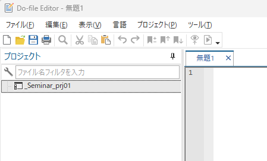
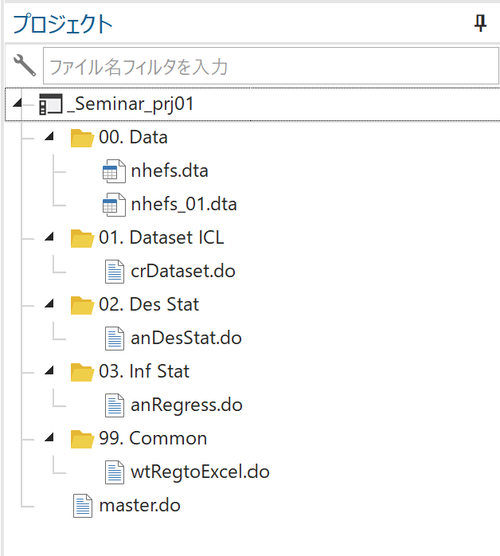
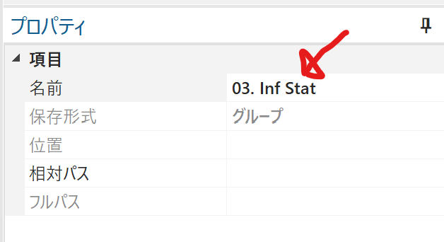

# 今日のゴール
* サンプルデータの解析（IPTWによる解析）を行なう

# 今日の目的
* Lecture3のProjectファイルに追加する。
* 最小限の労力でIPTWの結果をまとめる。

# サンプルデータ
[Causal Inference: What If](https://www.hsph.harvard.edu/miguel-hernan/causal-inference-book/)サイトにあるNHEFSデータを用います。

前回（Lecture 3）と同様のデータで解析を実行しますので、前回と同じフォルダを作業フォルダとして下さい。

# 解析方針
## Estimand

|   | ATE | ATT | ATU | Conditional ATE | Local ATE | ATO |
|:-:| :-: | :-: | :-: | :-:             | :-:       | :-: |
| **標的集団** | 集団全体 | 介入者・曝露者 | 非介入者・非曝露者 | 集団全体  | Complier       | いずれにもなりうる集団 |
|**解析方法**| IPTW・多変量回帰等 | PSM[^3]等 | PSM等 | 多変量回帰モデル等 | 操作変数法 | オーバーラップ重み付け |

* ATE = Average Treatment Effect
* ATT = Average Treatment Effect on the Treated (StataではATETと表現されています)
* ATU = Average Treatment Effect on the Untreated
* ATO = Average Treatment Effect on the Overlapped
* IPTW = Inverse Probability of Treatment Weighing
* PSM = Propensity Score Matching

今回も**ATE**を推定することを目指します。

## 研究仮説
Estimandを含めて研究仮説を追記します。今回も中間事象は詳細に検討しませんが、脱落などがあれば削除するという方針にしています。

* P: 1970年代～1980年代に生きていた成人アメリカ人。
* E: ベースライン(1971年）からフォローアップ(1982年)までの間に禁煙した。
* C: 上記期間に禁煙していない。
* O: 上記期間の体重変化
* Estimand: ATE(Average Treatment Effect)
* 中間事象: 脱落者は除外（Listwise除去）

## 解析方針「IPTW」
ATEを求めるために、下記の様な手順をとることにします。手順1つあたりに1つのdoファイルで実行します。今回はIPTWを行うため、手順が増えています。

ただし、(done)の箇所は、Lecture 3と同じdo-fileで実行できるので今回は割愛します。

1. データ読み込み (done)
2. データ整理 (done)
3. 記述統計量 (done)
4. 傾向スコア・IPTWの算出
6. 傾向スコア・IPTWの評価
7. 粗解析モデル (done)
8. 調整モデル（＝IPTW）
9. Excelに書出 (done)

## 使う変数名
* 曝露変数: qsmk (1=禁煙, 0=禁煙なし)
* アウトカム: wt82_71 (1971年から1982年までの体重変化)
* 交絡変数=傾向スコア算出に用いる変数
    * sex
    * age
    * race
    * education
    * smokeintensity
    * smokeyrs
    * exercise
    * active
    * wt71

# Stataでの操作
## 操作（1） Project fileの設定
Stata Project fileを作成・設定します。

今回は、Lecture3で作成したプロジェクトファイルに修正・追記していきます。

<Lecture3のコピー、ここから>

1. Stataを起動する。
2. 作業フォルダのアドレスを取得する。
3. `cd "作業フォルダのアドレス貼り付け"`を実行
4. （Windows/Unixのみ）`doedit`を実行
5. メニューからプロジェクトファイルを作成。
6. 名前は何でも良いですが、今回は`_Seminar_prj01.stpr`としました。
7. 画面がこんな感じになっているはず。



<Lecture3のコピー、ここまで>

今回はLecture3で作成した`stpr`ファイルを開くだけでOKです。

## 操作（2）Project fileの変更
IPTWを行うために、このプロジェクトファイルにグループを作っていきます。

現状で、プロジェクトウィンドウ（do editor画面左上にある）が下図のようになっていることを想定しています。



ここからグループ名のリネームと新グループ作成を行います。リネームは単に数値を入れ替えるためのものです。

傾向スコア関係のグループを作成します。傾向スコアに関するグループ名は「03.PS」とします。

1. `_Seminar_prj01.stpr`の箇所で右クリックし、メニューを表示させる。
1. 「新規グループを追加」を選択する。
1. 下記のグループを追加する。
    * `03. PS`

このままでは、「03.Inf Stat」と番号が重複しますので、これを修正します。

名前の修正は、フォルダアイコンで示されているところでもできますが、ここでは、プロパティウィンドウを利用します。

1. プロジェクトウィンドで、「03.Inf Stat」を選択します。
2. プロパティウィンドウの赤矢印部分をクリックします。
    * なお、プロジェクトウィンドウのすぐ下にあります。
1. グループ名を「04.Inf Stat」に変更します。



## 操作（3） master.doファイルを編集
master.doファイルには、複数のファイルの相互関係や動作順についてもしています。今回は、解析方針「IPTW」で計画した様に追加します。

新たに、下記の2つのdo-fileを作成する計画です。
* anPScalc
* anPSeval

```stata
/**** ***** ***** ***** ***** ***** *****
*
* Stata Seminar 2022, NHEFS analysis 01
*
***** ***** ***** ***** ***** ***** ****/

* データセット読込み整理
do crDataset

* 記述統計
do anDesStat

///// ここから追記箇所 /////
* 傾向スコア・IPTW算出
do anPScalc

* 傾向スコア・IPTWの評価
do anPSeval

///// ここまで追記箇所 /////

* 粗解析モデル
do anRegress model_1

* 調整モデル
do anRegress model_2

* IPTWモデル // 追記箇所
do anIPTW

* 3モデル（粗解析モデルと調整モデルとIPTWモデル）の結果をExcel書出し 編集箇所
do wtRegtoExcel 3 // 3に書き換えた。
```

## 操作（3） anPScals.doの作成
傾向スコアを計算し、IPTW重み付けを行うためのdo-fileを作成します。プロジェクトファイルの`03. PS`グループにdo-fileを新規作成します。

傾向スコアは、ざっくりいうと、**条件付けられた曝露確率**です。色々な方法で計算可能ですが、オーソドックスにロジスティック回帰分析をもとに計算します。

禁煙群と非禁煙群でバランスを取りたい変数で条件付けます。

例えば、禁煙群と非禁煙群で性別の割合を調整したいとすると、下記の様なコードになります。

```stata
logit qsmk sex
predict prob, pr
gen prob_scrach = 1/(1+exp(-0.3202065*sex - 0.9016385)^(-1))
su prob*
```

ロジスティック回帰分析を行うと、その結果（回帰係数）を元に個々人の曝露確率が計算可能です。`predict`コマンドは直前の一般化線形モデルで推定した回帰係数を元にいろいろな数値を計算するためのコマンドです。

ここでは、`pr`オプションを利用していますので、直前のロジスティック回帰分析の結果（算出された回帰係数）からqsmk==1となる確率を計算しています。この計算式は下記になります。

$$ prob = \frac{1}{1+exp(β_0 + β_1sex)^{-1}} $$

上記のサンプルコードの3行目で同様の計算をしています。実際に`predict`コマンドで算出した変数`prob`と`gen`コマンドで計算式を用いた変数`prob_scrach`で同じ値になっています。


今回は、もっと多くの変数で条件付けるので、下記のdo-fileを作成します。

```stata
/**** ***** ***** ***** ***** ***** *****
*
* Stata Seminar 2022, NHEFS analysis 01
* Propensity Score Calculation
*
***** ***** ***** ***** ***** ***** ****/
version 17

* データ読み込み
use nhefs_01, clear

local conf_var  sex age race i.education smokeintensity smokeyrs i.exercise i.active wt71
local conf_var2 sex race c.age##c.age i.education c.smokeintensity##c.smokeintensity ///
c.smokeyrs##c.smokeyrs i.exercise i.active c.wt71##c.wt71

* Conditional probability of Quit smoking
xi:logit qsmk `conf_var'
predict ps, pr

* Unconditional probability of Quit smoking
logit qsmk
predict uncp, pr

* 重み計算
gen unwt = 1
gen iptw = cond(qsmk==1, 1/ps, 1/(1-ps)) if !missing(ps)
gen stdw = cond(qsmk==1, uncp/ps, (1-uncp)/(1-ps)) if !missing(ps, uncp)　// 参考
gen ovlw = cond(qsmk==1, 1-ps, ps) if !missing(ps) // 参考

label variable ps "Propensity Score"
label variable uncp "Unconditional Probability"
label variable unwt "=1 constant"
label variable iptw "Inverse Probability Treatement Weight"
label variable stdw "Standardized Weight" // 今回は使わない
label variable ovlw "Overlap Weight" // 今回は使わない

* 新しいデータセットとしてセーブ
compress
label data "nhefs_01 + PS & IPTW"
save nhefs_02, replace
```
重み付けのための「重み」をいくつか計算しています。今回は、iptw以外は気にしないで下さい。

傾向スコアや重みの計算が終わったデータを新しい名前で保存します。**元の名前では保存しません。**

### 傾向スコアの計算 

`local`コマンドで、条件付ける変数を指定しています。

`conf_var`では、一次項のみですが、`conf_var2`では二乗項や交互作用項も含んでいます。後から見るとおり、後者でよりよいバランス調整になります。

* ``xi:logit qsmk `conf_var' ``

後から、このコマンドの`` `conf_var' ``部分を変更することで、`conf_var2`の場合のバランスを確認します。

* `predict ps, pr`
* 
ここで出てきた`変数ps`に傾向スコアが格納されます。

### 傾向スコアから重みの算出

IPTWは、次の様に計算できます。

$$ IPTW_{exposed} = \frac{1}{ps} $$ 

$$ IPTW_{unexposed} = \frac{1}{1-ps} $$ 

これをStataでは下記の様にコマンド指定しています。

* `gen iptw = cond(qsmk==1, 1/ps, 1/(1-ps)) if !missing(ps)`

`cond関数`は、3つの引数をもった関数です。1つ目の引数には条件を記載します。これが成立するならば（真であれば）、cond関数は2つ目の値を返します。成立していなければ（偽であれば）、3つ目の値を返します。

また、ifの後の`!missing(ps)`は変数psが欠損ではない、ということを意味しています。

なお、こっそり他の重み付け方法（Standardized weight、Overlap weight）も行っていますが、そのうち出てきます。ここでは一旦置いておきます。

### 汎用化のための工夫

このdo-fileでは、下記のようなコマンドで変数unwtを作っています。この変数は

* `gen unwt = 1`

重みを付けた解析はには、`` [pw=weight] ``という表記を追加します。この表記自体を入れなければ、重み付け無しの解析になります。そのため、重み付けなしの解析と重み付けありの解析を行う時には、次のような記載になります。

```stata
regress y x
regress y x [pw=iptw]
```

この書き方でも良いのですが、重み部分をローカルマクロで書く事は出来ません。似た解析なので、できればまとめたいところです。

先ほどの変数unwtを使うと次の様にかけます。

```stata
regress y x [pw=unwt]
regress y x [pw=iptw]
```

こうすれば、重み部分をローカルマクロで書き換えて、下記の様に書く事ができます。ローカルマクロ`` `w' ``に重み変数を入れてやればOKです.

```stata
regress y x [pw=`w']
```

## 操作（4） anPSeval.doを作成
計算した傾向スコア（というか重み）を評価します。

いくつかの外部コマンドを利用します。

```stata
/**** ***** ***** ***** ***** ***** *****
*
* Stata Seminar 2022, NHEFS analysis 01
* Propensity Score Evaluation
*
***** ***** ***** ***** ***** ***** ****/
version 17

* データ読み込み
use nhefs_02, clear

* 外部コマンド
// ssc install schemepack, replace // イケてる感じのグラフテーマ集
// ssc install bihist, replace     // 上下に伸びるヒストグラム（ヒストグラムの比較に便利）
// ssc install covbal, replace        // 変数バランスの確認
// net install grc1leg.pkg, replace from(http://www.stata.com/users/vwiggins/)  // グラフの結合
// net install gr0034.pkg, replace from(http://www.stata-journal.com/software/sj8-2/) // labmask

* 事前設定
set scheme white_tableau
local wt unwt iptw // stdw ovlw


* 図示による傾向スコアの分布
foreach w of local wt {
	bihist ps [pw=`w'], by(qsmk) percent width(0.05) start(0) ///
		tw( xtitle(Propensity Score) ytitle(Percent) ///
			legend(row(2) order(2 1) label(1 "No Quit") label(2 "Quit"))) ///
		name(`w'_hist, replace)
}

grc1leg unwt_hist iptw_hist,  ycommon position(3) name(comb_hist, replace)

* 交絡要因のバランスについて確認
foreach w of local wt {
	covbal qsmk sex age race smokeintensity smokeyrs wt71 _I*, wt(`w') saving(bal_`w', replace)
}

* 交絡要因のバランスを図示
capture frame change default
capture frame drop covbal
frame create covbal
frame covbal {
	use bal_unwt, clear
	gen odr = _N - _n + 1
	keep odr varname stdiff varratio
	rename stdiff stdiff_unwt
	rename varratio varratio_unwt
	
	merge 1:1 varname using bal_iptw
	assert _merge == 3 // _merge==3以外があれば、何かおかしいのでassertで止める
	drop _merge tr_mean tr_var tr_skew con_mean con_var con_skew
	rename stdiff stdiff_iptw
	rename varratio varratio_iptw
	sort odr
	
	labmask odr, value(varname)
	
	/* カラーパレット設定
	colorpalette hcl, select(1 6 9) nograph
	local unadj `r(p1)'
	local adj `r(p3)'
	local zero `r(p2)'*/
	
	* 標準化差のグラフ
	twoway ///
		scatter odr stdiff_unwt, ylabel(14(1)1, valuelabel) mcolor("`unadj'") || ///
		scatter odr stdiff_iptw, ylabel(14(1)1, valuelabel) mcolor("`adj'") || ///
		function y= 0.1, horizontal range(0 14) lcolor(gs8) lpattern(shortdash) || ///
		function y=-0.1, horizontal range(0 14) lcolor(gs8) lpattern(shortdash) || ///
		function y=0   , horizontal range(0 14) lcolor("`zero'")  ///
		legend(order(1 "Unadjusted" 2 "Adjusted")) ///
		xtitle("Standardized Mean Difrences") title(Covariate Balance) ///
		name(bal_smd, replace)
	
	* 分散比のグラフ
	twoway ///
		scatter odr varratio_unwt, ylabel(14(1)1, valuelabel) mcolor("`unadj'") || ///
		scatter odr varratio_iptw, ylabel(14(1)1, valuelabel) mcolor("`adj'")|| ///
		function y=1.25, horizontal range(0 14) lcolor(gs8) lpattern(shortdash) || ///
		function y= 0.8, horizontal range(0 14) lcolor(gs8) lpattern(shortdash) || ///
		function y=   1, horizontal range(0 14) lcolor("`zero'")  ///
		legend(order(1 "Unadjusted" 2 "Adjusted")) ///
		xscale(log) xlabel(0.7 0.8(0.2)1.0 1.25) xscale(extend) ///
		xtitle("Variance Ratio, log-scale") title(Covariate Balance) ///
		name(bal_vr, replace)
}
```

かなり長大なdo-fileになりました（87行）。このうち39行目以降は、図示するためのコマンドです。そのうち、これをadoファイル化したいと思っています[^1]。

大きく4つのパートに分かれています。

1. 事前設定
2. 傾向スコア分布の群間差の図示
3. 共変量バランスの評価・表記
4. 共変量バランスの評価・図示

### 傾向スコア分布の群間差の図示

傾向スコアの分布については、ヒストグラムを用います。

Rでは（Pythonでも）、上下に分かれるようなヒストグラムを描かれることが多くなっています。

Stataでは、上下に分かれる「棒グラフ」は作れるのですが、上下に分かれるヒストグラムを標準で作成することができません。

そのため、外部コマンドbihistを用います。

```stata
foreach w of local wt {
	bihist ps [pw=`w'], by(qsmk) percent width(0.05) start(0) ///
		tw( xtitle(Propensity Score) ytitle(Percent) ///
			legend(row(2) order(2 1) label(1 "No Quit") label(2 "Quit"))) ///
		name(`w'_hist, replace)
}
```

ここでは`foreach`でループをかけていますが、重み付け無し（w=unwt）とIPTW（w=iptw）の二通りを行っています。nameオプションで、グラフに名前をつけています。名前を付けておけば、後で操作するときに便利なので、極力グラフにはnameオプションで名前を付けて下さい。
bihistコマンドは、ややトリッキーでグラフのラベルやレジェンドについては、twオプション内に記載することになります。

また2つのグラフを1つにまとめるために、grc1legという外部コマンドを利用します。標準では`graph combine`というコマンドでグラフをまとめることができるのですが、Legendをまとめてくれないという欠点があります。

```stata
grc1leg unwt_hist iptw_hist,  ycommon position(3) name(comb_hist, replace)
```   

このコマンドで下記の様なグラフが作成できます。


左側（重み付け前）よりも右側（重み付け後）で上下のヒストグラムが揃っていることが分かるかと思います。

### 共変量バランスの評価・表記

評価には、標準化差と分散比を用いて行います。下記の基準に収まっているかどうか確認します。

|評価指標|厳しい基準|緩い基準|
|-|-|-|
|標準化差|-0.1~+0.1|-0.25~+0.25|
|分散比|0.8~1.25|0.5~2.0|

ここでは`外部コマンドcovbal`を用いて評価します。

`covbalコマンド`は、下記の様に使っています。

```stata
foreach w of local wt {
	covbal qsmk sex age race smokeintensity smokeyrs wt71 _I*, wt(`w') saving(bal_`w', replace)
}
```

`covbal`の1つめの変数に群分けする変数を入れます。ここでは`qsmk`です。

2つめ以降の変数について、バランスを確認します。

`` wt(`w')オプション ``は、共変量バランスを計算するときの重みを指定します。

`saving()オプション` は、得られた表を外部にdtaファイルとして出力するためのオプションです。

ところで、見慣れない変数名があります。`_I*`という変数は見慣れませんが、データセットには確かに存在しています。これらは何でしょうか。

### `_I*`とはどのような変数か？
ロジスティック回帰分析を行った時に`xi:`というプレフィックスコマンドを書いていました。

Stataではダミー変数化するときに、その変数の前に`i.`をつけることで実行します。このときにStataは一時的に、`_I`から始まる名前のダミー変数を自動で作ります。

例えば、`変数active`をダミー変数化するときには、`i.active`と記載します。そうすると、Stataは下記の様な変数を作ります。なお、変数activeは、0, 1, 2の3カテゴリを持っています。

|ダミー変数|意味|
|-|-|
|`_Iactive_1`|active==1|
|`_Iactive_2`|active==2|

このダミー変数は、通常であれば解析終了後に自動で削除される一時的な変数です。これを後から利用する場合には、解析コマンドの前に`xi:`を使うことで、一時変数を残すことができます。

`anPScalc.do`では、`` xi:logit qsmk `conf_var' ``のように`xi:`を使っていました。

そして、`_I*`の`*`は、ワイルドカードです。ワイルドカードは、0文字以上の任意の文字と同値です。該当する変数を全て記載することと同等になります。

ここでの`_I*`は、`_I`から始まる全ての変数をリストアップしていることと同等です。つまり、`xi:`で残したダミー変数全てと同じ意味になっています。


[^1]:今世紀中を予定
